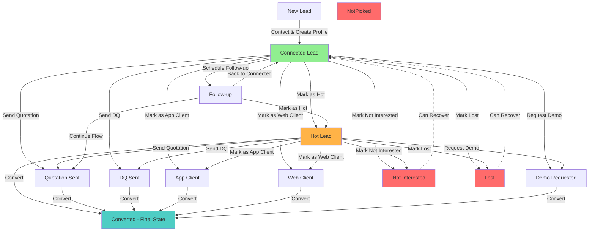

# Sales Lead Flow Analysis and Fix

## Current Flow Analysis

### Current Backend Logic (Already Correct)

The backend query for "connected" leads (`backend/controllers/salesController.js:1517-1524`) correctly shows:

- All leads with `leadProfile` (contacted/profiled)
- Excluding only: `converted`, `lost`, `not_interested`
- **Hot leads ARE included** (not in exclusion list)

### Current Frontend Issue

In `frontend/src/modules/sells/SL-pages/SL_connected.jsx:118-124`, when status changes:

- Lead is immediately removed from UI: `setLeadsData(prev => prev.filter(lead => lead._id !== leadId))`
- This happens for ALL status changes, including "hot"
- This causes hot leads to disappear even though backend would return them

### Status Transition Rules

From `backend/models/Lead.js` and `backend/controllers/salesController.js`:

- `connected` → can go to: `hot`, `followup`, `quotation_sent`, `dq_sent`, `app_client`, `web`, `demo_requested`, `not_interested`, `lost`
- `hot` → can go to: `quotation_sent`, `dq_sent`, `app_client`, `web`, `demo_requested`, `converted`, `not_interested`, `lost`
- **Issue**: `hot` cannot transition back to `connected` (one-way)

## Lead Flow Diagram

## Issues Found

1. **Frontend removes leads immediately on status change** - Should only remove if status is `not_interested`, `not_picked`, or `converted`
2. **Hot leads disappear from connected page** - Should remain visible
3. **Missing `not_picked` in exclusion list** - Backend excludes `converted`, `lost`, `not_interested` but not `not_picked`
4. **Status transition from `hot`** - Cannot go back to `connected` (may need to allow this)

## Implementation Plan

### 1. Fix Backend Connected Leads Query

**File**: `backend/controllers/salesController.js:1517-1524`

- Add `not_picked` to exclusion list: `status: { $nin: ['converted', 'lost', 'not_interested', 'not_picked'] }`

### 2. Fix Frontend Connected Leads Page

**File**: `frontend/src/modules/sells/SL-pages/SL_connected.jsx:118-124`

- Modify `handleStatusChange` to only remove lead if status is `not_interested`, `not_picked`, or `converted`
- Keep lead visible for all other status changes (including `hot`)

### 3. Update Status Transitions (Optional Enhancement)

**File**: `backend/models/Lead.js:179` and `backend/controllers/salesController.js:1816`

- Consider allowing `hot` → `connected` transition for flexibility
- Current: `hot: ['quotation_sent', 'dq_sent', ...]`
- Proposed: `hot: ['connected', 'quotation_sent', 'dq_sent', ...]`

### 4. Verify Hot Leads Page

**File**: `frontend/src/modules/sells/SL-pages/SL_hot_leads.jsx:182-200`

- Ensure hot leads page doesn't remove leads when changing to other statuses that should keep them visible
- Similar fix may be needed here

### 5. Update Dashboard Stats (Already Correct)

**File**: `backend/controllers/salesController.js:1302-1307`

- Verify connected count calculation includes hot leads
- Current logic already correct: excludes only `converted`, `lost`, `not_interested`

## Files to Modify

1. `backend/controllers/salesController.js` - Add `not_picked` to exclusion list
2. `frontend/src/modules/sells/SL-pages/SL_connected.jsx` - Fix status change handler
3. `backend/models/Lead.js` - (Optional) Allow hot → connected transition
4. `backend/controllers/salesController.js` - (Optional) Update transition validation
5. `frontend/src/modules/sells/SL-pages/SL_hot_leads.jsx` - (Review) Ensure consistent behavior

## Testing Checklist

- [ ] Mark connected lead as "hot" → Should remain visible in connected leads
- [ ] Mark connected lead as "not_interested" → Should disappear from connected leads
- [ ] Mark connected lead as "not_picked" → Should disappear from connected leads
- [ ] Mark connected lead as "converted" → Should disappear from connected leads
- [ ] Hot leads appear in both connected leads page and hot leads page
- [ ] Dashboard stats show correct connected count (includes hot leads)