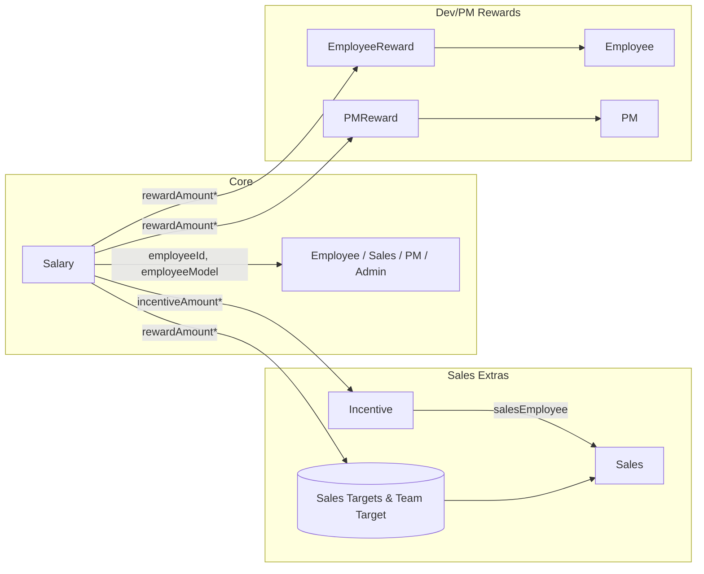
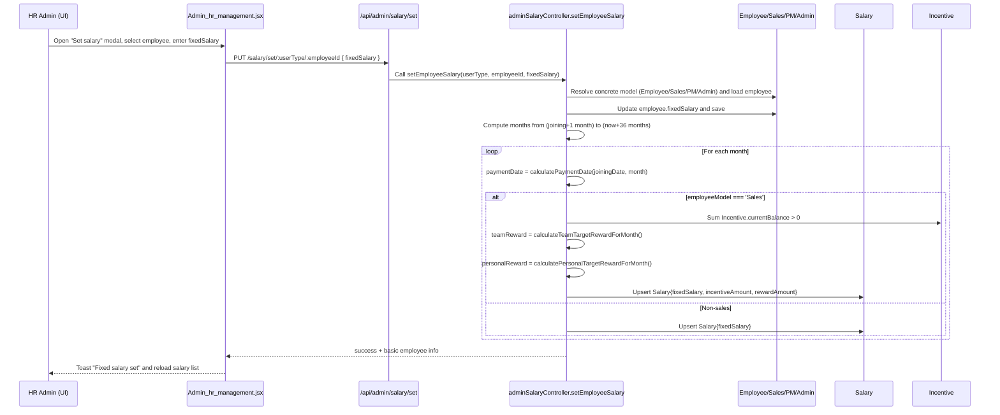
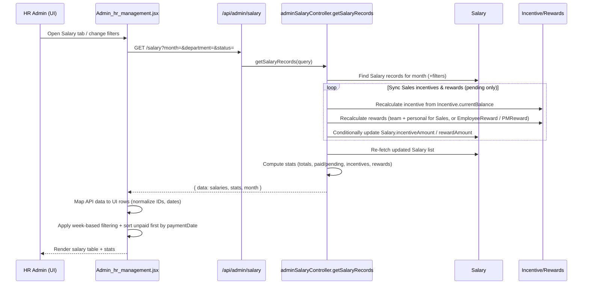
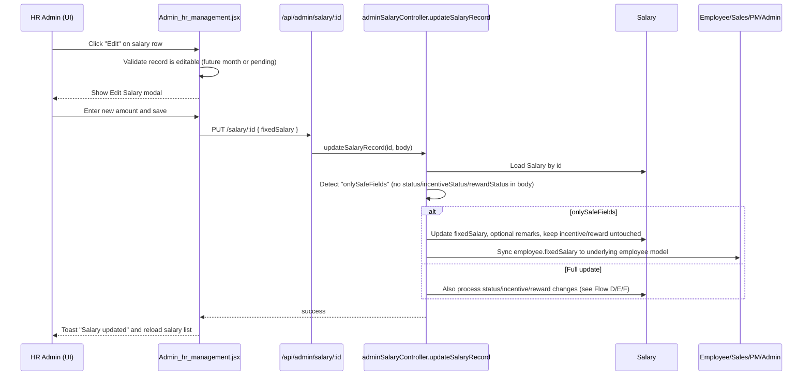
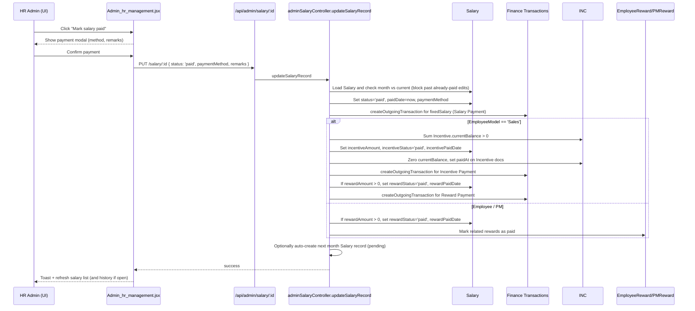
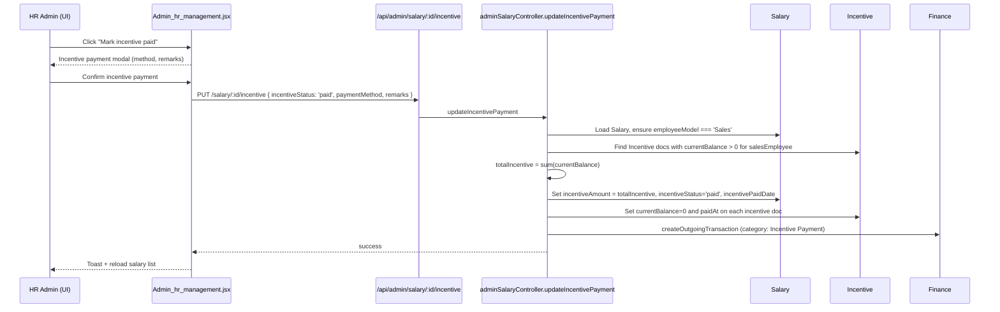
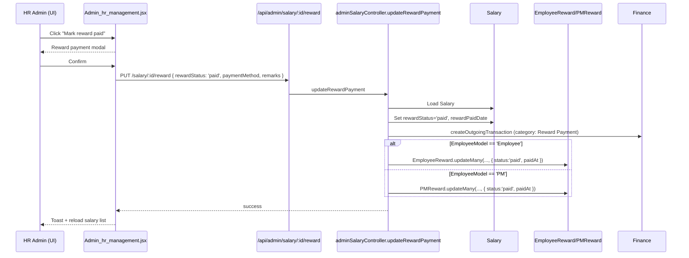
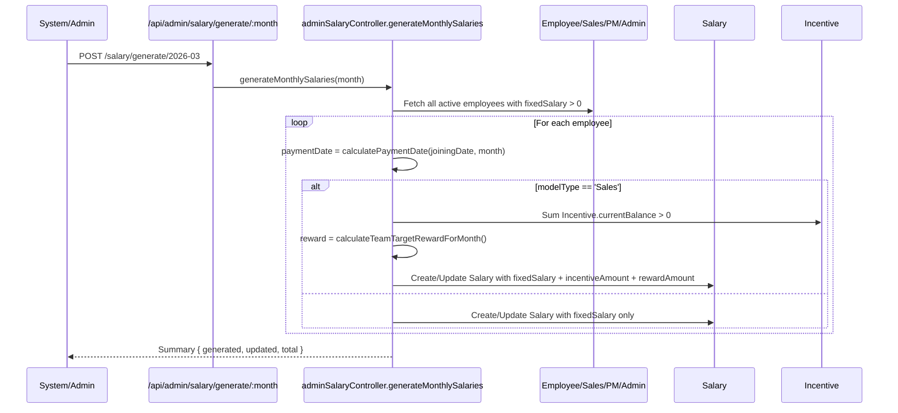
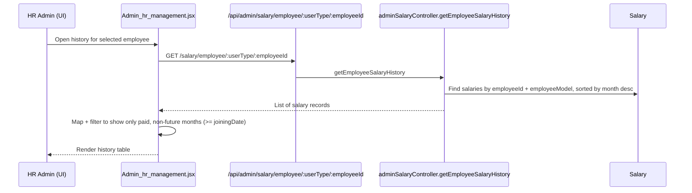

## Salary Management Flow – HR Module

### 1. High-level overview
- **Entry point (UI)**: `Admin_hr_management.jsx` → HR tab **Salary**.
- **Core backend controller**: `backend/controllers/adminSalaryController.js`.
- **Data model**: `backend/models/Salary.js`.

The system manages:
- Fixed monthly salary for all employee types (Employee, Sales, PM, Admin/HR).
- Incentive and reward amounts primarily for the Sales team, plus rewards for Dev/PM via `EmployeeReward` / `PMReward`.

---

### 2. Data model (Salary)

Key fields (simplified):
- `employeeId`, `employeeModel` (`Employee` | `Sales` | `PM` | `Admin`)
- `employeeName`, `department`, `role`
- `month` (YYYY-MM), `fixedSalary`
- `paymentDate`, `paymentDay`
- `status` (pending/paid), `paidDate`, `paymentMethod`, `remarks`
- Incentive (Sales only): `incentiveAmount`, `incentiveStatus`, `incentivePaidDate`
- Reward: `rewardAmount`, `rewardStatus`, `rewardPaidDate`
- Audit: `createdBy`, `updatedBy`

Graph of relationships:

`*` means the value is derived from these models, not stored independently.

---

### 3. Flow A – Set fixed salary for an employee

**UI path:** HR → Salary → “Set salary” modal  
**Frontend:** `Admin_hr_management.jsx` → `handleSetEmployeeSalary` (via `adminSalaryService.setEmployeeSalary`)  
**Backend route:** `PUT /api/admin/salary/set/:userType/:employeeId` → `setEmployeeSalary`

Mermaid sequence:

Key points:
- Sets both the **employee’s own `fixedSalary`** and creates/updates many future `Salary` records.
- For Sales, `incentiveAmount` is taken from current `Incentive.currentBalance`, and `rewardAmount` is combination of **team** and **personal** target rewards for each month.

---

### 4. Flow B – View salary list for selected month

**UI path:** HR → Salary tab (with filters for month, department, status, week).  
**Frontend:**  
- `loadSalaryData(selectedSalaryMonth)`  
- `getFilteredSalaryData()` for week and status filters.  
**Backend route:** `GET /api/admin/salary?month=&department=&status=&search=` → `getSalaryRecords`

Mermaid sequence:

Key frontend behaviour:
- `loadSalaryData` always calls backend and then:
  - Normalizes `_id` and `employeeId` to strings.
  - Casts dates into JS `Date` objects.
  - Stores incentive/reward and their statuses for actions.
- `getFilteredSalaryData`:
  - Optional week‑wise filtering (1st–4th week by `paymentDate` day).
  - Sort order: **unpaid first (nearest `paymentDate` first)**, then paid (recent first).

---

### 5. Flow C – Edit salary amount

**UI path:** Salary list → row action “Edit”.  
**Frontend:** `handleEditSalary` → `handleSaveSalaryEdit` → `adminSalaryService.updateSalaryRecord`.  
**Backend route:** `PUT /api/admin/salary/:id` → `updateSalaryRecord`.

Mermaid sequence:

Business rules:
- Past **paid** months are read‑only; only **future or pending** months can be edited.
- Editing with only `fixedSalary` will **not** modify `incentiveAmount` or `rewardAmount`; these are preserved until explicitly changed or resynced.

---

### 6. Flow D – Mark salary as paid (main salary)

**UI path:** Salary list → “Mark salary paid”.  
**Frontend:** `handleMarkSalaryPaid` → `confirmSalaryPayment`.  
**Backend route:** `PUT /api/admin/salary/:id` with `status: 'paid'` → `updateSalaryRecord`.

Mermaid sequence:

Notes:
- Finance integration ensures every salary / incentive / reward payout is mirrored in outgoing finance transactions.
- Cancelling salary payment (status back to `pending`) will also call finance cancellation for the related salary transaction.

---

### 7. Flow E – Mark incentive as paid (Sales only)

**UI path:** Salary list → action on incentive column (for Sales) → “Mark Incentive Paid”.  
**Frontend:** `handleMarkIncentivePaid` → `confirmIncentivePayment`.  
**Backend route:** `PUT /api/admin/salary/:id/incentive` → `updateIncentivePayment`.

Mermaid sequence:

If status is changed back to `pending`, the salary record’s `incentivePaidDate` is cleared and the related finance transaction is cancelled via helper.

---

### 8. Flow F – Mark reward as paid (Sales / Dev / PM)

**UI path:** Salary list → action on reward column → “Mark Reward Paid”.  
**Frontend:** `handleMarkRewardPaid` → `confirmRewardPayment`.  
**Backend routes:**
- `PUT /api/admin/salary/:id` with `rewardStatus`
- or `PUT /api/admin/salary/:id/reward` via `updateRewardPayment`

Mermaid sequence (generic):

Changing reward back to `pending` clears `rewardPaidDate` and cancels the finance transaction.

---

### 9. Flow G – Generate salaries for a specific month (bulk)

**Admin utility (backend only or via some button):**  
**Route:** `POST /api/admin/salary/generate/:month` → `generateMonthlySalaries`.

Mermaid sequence:

---

### 10. Flow H – Salary history per employee

**UI path:** Within HR Salary → open employee history.  
**Frontend:** `adminSalaryService.getEmployeeSalaryHistory` → history modal.  
**Backend route:** `GET /api/admin/salary/employee/:userType/:employeeId` → `getEmployeeSalaryHistory`.

Mermaid sequence:

---

### 11. Summary of end-to-end behaviour

- HR can:
  - **Set fixed salary** once, which auto‑generates a long horizon of monthly salary records.
  - **View, filter, and sort** salary records per month with statistics and week‑wise grouping.
  - **Edit salary amounts** for upcoming/pending months without touching incentives/rewards.
  - **Mark salary, incentives, and rewards as paid**, which:
    - Updates status and timestamps on the `Salary` record.
    - Clears source balances (for incentives).
    - Syncs Dev/PM rewards from their own models.
    - Always creates matching **finance transactions**.
  - **Generate missing records** in bulk for a given month and inspect **salary history** per employee.

