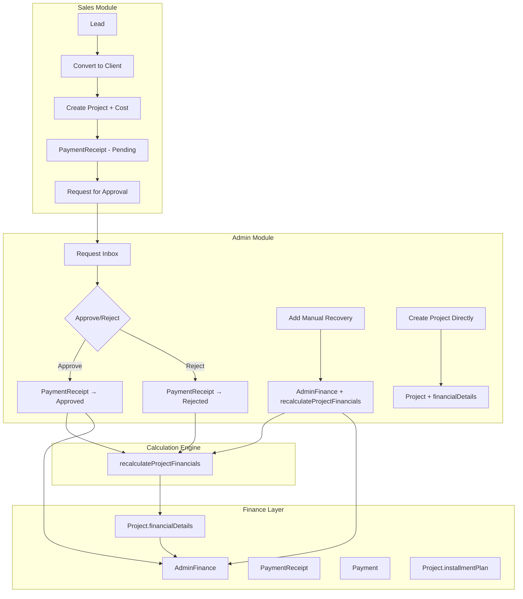
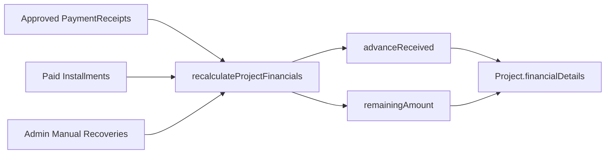
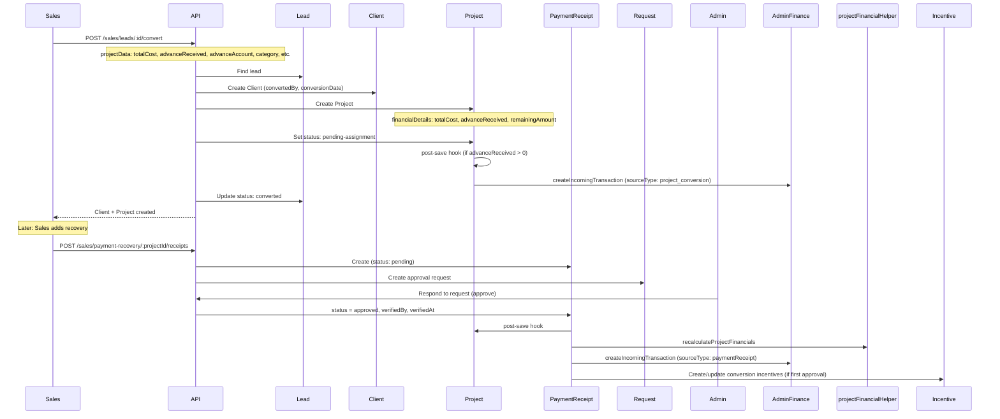
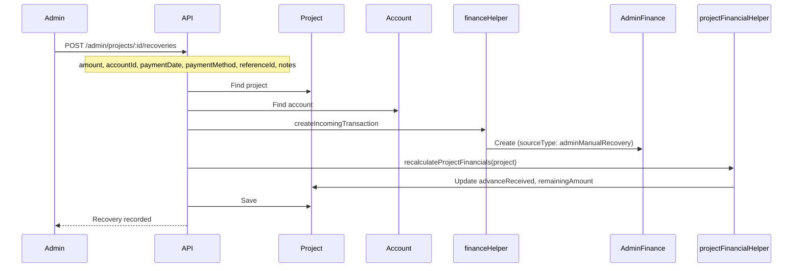
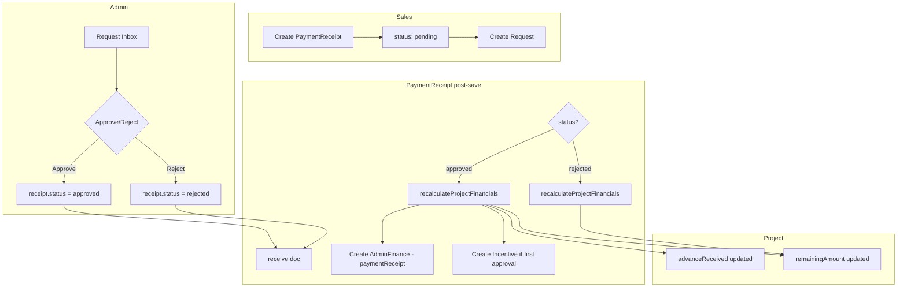
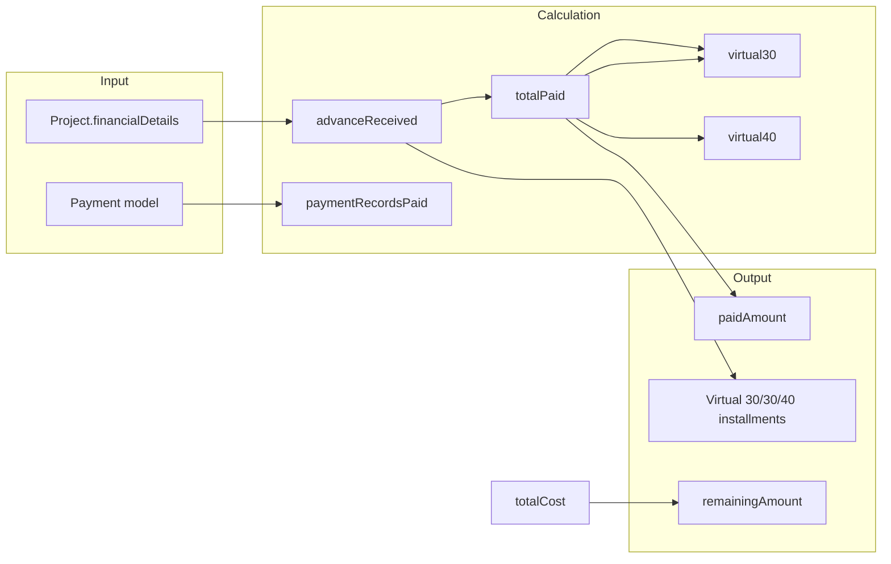

# Financial Flow & Calculations – Complete System Documentation

This document describes how financial data flows across all modules, how calculations are performed, and how transactions connect from Sales → Admin → Finance → Client Wallet.

---

## 1. High-Level System Overview



---

## 2. Data Sources for Financial Totals

| Source | Model | When Created | Counted In |
|--------|-------|--------------|------------|
| **Approved PaymentReceipts** | `PaymentReceipt` | Sales adds recovery → Admin approves | `advanceReceived`, AdminFinance (via post-save), Finance stats |
| **Admin Manual Recoveries** | `AdminFinance` (`sourceType: adminManualRecovery`) | Admin adds recovery via project modal | `advanceReceived`, Finance stats |
| **Paid Installments** | `Project.installmentPlan` (status: paid) | Admin marks installment paid / legacy | `advanceReceived`, Finance stats |
| **Project Conversion Advance** | `Project.financialDetails.advanceReceived` (initial) | Sales converts lead with advance | AdminFinance (`sourceType: project_conversion`), Finance stats |
| **Client Payments** | `Payment` (status: completed) | PM/Client pays milestone | Finance stats (separate from advanceReceived) |

---

## 3. Single Source of Truth: `recalculateProjectFinancials`

**Location:** `backend/utils/projectFinancialHelper.js`

All project-level financial totals (`advanceReceived`, `remainingAmount`) are derived from this function. **No other code should directly set these fields.**



**Formula:**
```
totalReceived = totalApprovedPayments + collectedFromInstallments + totalManualRecoveries
advanceReceived = totalReceived
remainingAmount = max(totalCost - totalReceived, 0)
```

**When it runs:**
- PaymentReceipt approved/rejected (post-save hook)
- Admin adds manual recovery
- Admin adds/updates/deletes installments
- Request controller approves installment payment
- Sales `getClientProfile` (for display consistency)
- Client project controller (for wallet consistency)

---

## 4. Sales Employee Flow: Adding Client with Cost



**Effect on Admin Panel:**
- New project appears in Admin Project Management.
- `financialDetails.totalCost`, `advanceReceived`, `remainingAmount` drive:
  - Admin dashboard stats (sales, revenue, pending)
  - Finance dashboard
  - Project view modal
- AdminFinance `project_conversion` transaction shows in Finance Management.
- Admin approval of PaymentReceipt updates project financials and creates Finance transaction.

---

## 5. Admin Flow: Adding Manual Recovery



**Effect:**
- AdminFinance gets new incoming transaction with `metadata.sourceType: 'adminManualRecovery'`.
- `recalculateProjectFinancials` includes it in `totalReceived` → `advanceReceived` ↑, `remainingAmount` ↓.
- Visible in:
  - Admin project view modal
  - Sales client profile (transactions)
  - Sales payment recovery (payment history)
  - Client wallet (via `advanceReceived`)
  - Finance dashboard (revenue stats)

**Note:** Admin manual recoveries do **not** create PaymentReceipts or trigger sales incentives.

---

## 6. PaymentReceipt Approval Flow



**Important:** Pending PaymentReceipts do **not** change `remainingAmount`. Only approval/rejection triggers recalculation.

---

## 7. Finance Statistics Aggregation

**Location:** `backend/controllers/adminFinanceController.js` → `getFinanceStatistics`

```mermaid
flowchart TB
    subgraph Revenue["Revenue Sources"]
        R1[Payment - paidAt, status completed]
        R2[PaymentReceipt - verifiedAt, status approved]
        R3[Project.installmentPlan - paidDate, status paid]
        R4[AdminFinance incoming - transactionDate]
        R4 -.->|exclude| R5[sourceType: payment, projectInstallment, paymentReceipt]
    end

    subgraph Expense["Expense Sources"]
        E1[Salary - month, status paid]
        E2[ExpenseEntry - paidDate]
        E3[Incentive - paidAt]
        E4[PMReward - paidAt]
        E5[AdminFinance outgoing - transactionDate]
        E5 -.->|exclude| E6[sourceType: salary, incentive, reward, expenseEntry]
    end

    subgraph Sales["Sales in Period"]
        S1[Project - startDate in period]
        S2[advanceReceived > 0]
    end

    R1 --> TotalRevenue
    R2 --> TotalRevenue
    R3 --> TotalRevenue
    R4 --> TotalRevenue
    E1 --> TotalExpenses
    E2 --> TotalExpenses
    E3 --> TotalExpenses
    E4 --> TotalExpenses
    E5 --> TotalExpenses
    S1 --> TotalSales
    S2 --> TotalSales
```



**Period filters:** `timeFilter` uses `transactionDate`, `paidAt`, `verifiedAt`, `startDate` (for sales) per period (today, week, month, year, custom).

---

## 8. Client Wallet Flow

**Location:** `backend/controllers/clientWalletController.js` → `getWalletSummary`



**Key:** `advanceReceived` is the single source for "money received from advance + receipts + manual recoveries". Client wallet uses `Project.financialDetails.advanceReceived` (updated by `recalculateProjectFinancials`) and adds `Payment` model amounts on top.

---

## 9. Module Connection Map

```
┌─────────────────────────────────────────────────────────────────────────────────┐
│                           SALES MODULE                                            │
├─────────────────────────────────────────────────────────────────────────────────┤
│ • convertLeadToClient → Client, Project, Project.financialDetails                 │
│ • createPaymentReceipt → PaymentReceipt (pending), Request                        │
│ • getClientProfile, getPaymentRecovery → reads Project.financialDetails           │
│ • getClientTransactions → PaymentReceipt + AdminFinance (adminManualRecovery)     │
└─────────────────────────────────────────────────────────────────────────────────┘
                                      │
                                      ▼
┌─────────────────────────────────────────────────────────────────────────────────┐
│                           REQUEST MODULE                                          │
├─────────────────────────────────────────────────────────────────────────────────┤
│ • respondToRequest (approve) → PaymentReceipt.status = approved                   │
│ • PaymentReceipt post-save → recalculateProjectFinancials, AdminFinance           │
└─────────────────────────────────────────────────────────────────────────────────┘
                                      │
                                      ▼
┌─────────────────────────────────────────────────────────────────────────────────┐
│                     projectFinancialHelper (SHARED)                               │
├─────────────────────────────────────────────────────────────────────────────────┤
│ • recalculateProjectFinancials(project)                                           │
│   - Approved PaymentReceipts                                                       │
│   - Paid installments                                                             │
│   - AdminFinance (adminManualRecovery)                                            │
│   → project.financialDetails.advanceReceived, remainingAmount                     │
└─────────────────────────────────────────────────────────────────────────────────┘
                                      │
                                      ▼
┌─────────────────────────────────────────────────────────────────────────────────┐
│                           ADMIN MODULE                                            │
├─────────────────────────────────────────────────────────────────────────────────┤
│ • addProjectRecovery → AdminFinance + recalculateProjectFinancials                │
│ • addProjectInstallments → installmentPlan + recalculateProjectFinancials        │
│ • createProject → Project.financialDetails                                        │
│ • Admin dashboard, Finance dashboard → getFinanceStatistics, getDashboardStats    │
└─────────────────────────────────────────────────────────────────────────────────┘
                                      │
                                      ▼
┌─────────────────────────────────────────────────────────────────────────────────┐
│                           CLIENT WALLET                                           │
├─────────────────────────────────────────────────────────────────────────────────┤
│ • getWalletSummary → Project.financialDetails (advanceReceived, totalCost)        │
│ • Virtual 30/30/40 installments from totalCost vs paid amount                    │
└─────────────────────────────────────────────────────────────────────────────────┘
```

---

## 10. Finance Transaction Creation Points

| Trigger | sourceType | Created By |
|---------|------------|------------|
| Sales converts lead (advance) | `project_conversion` | Project post-save hook |
| Admin approves PaymentReceipt | `paymentReceipt` | PaymentReceipt post-save hook |
| Admin adds manual recovery | `adminManualRecovery` | addProjectRecovery |
| Admin approves installment paid | `projectInstallment` | requestController |
| Payment completed | `payment` | paymentController |
| Incentive paid | `incentive` | adminSalesController / salary |

---

## 11. Invariants (Never Break)

1. **Only `recalculateProjectFinancials` updates `advanceReceived` and `remainingAmount`** on Project.
2. **Pending PaymentReceipts never reduce `remainingAmount`** until admin approves.
3. **AdminFinance transactions must have `metadata.sourceType`** when they represent a source (payment, receipt, installment, manual recovery, etc.) so aggregations can exclude them correctly.
4. **Client wallet uses `Project.financialDetails.advanceReceived`** as the single source for "money received from project" (advance + receipts + manual recoveries + paid installments).

---

## 12. Quick Reference: Files by Responsibility

| File | Responsibility |
|------|----------------|
| `utils/projectFinancialHelper.js` | Recalculate project financials from actual data |
| `utils/financeTransactionHelper.js` | Create AdminFinance transactions with sourceType |
| `models/PaymentReceipt.js` | Post-save: recalc + create AdminFinance on approve/reject |
| `models/Project.js` | Post-save: create AdminFinance for project_conversion |
| `controllers/salesController.js` | Convert lead, create PaymentReceipt, get client profile |
| `controllers/adminProjectController.js` | Add manual recovery, installments |
| `controllers/requestController.js` | Approve/reject PaymentReceipt, approve installment |
| `controllers/adminFinanceController.js` | Finance statistics aggregation |
| `controllers/clientWalletController.js` | Client wallet summary |
