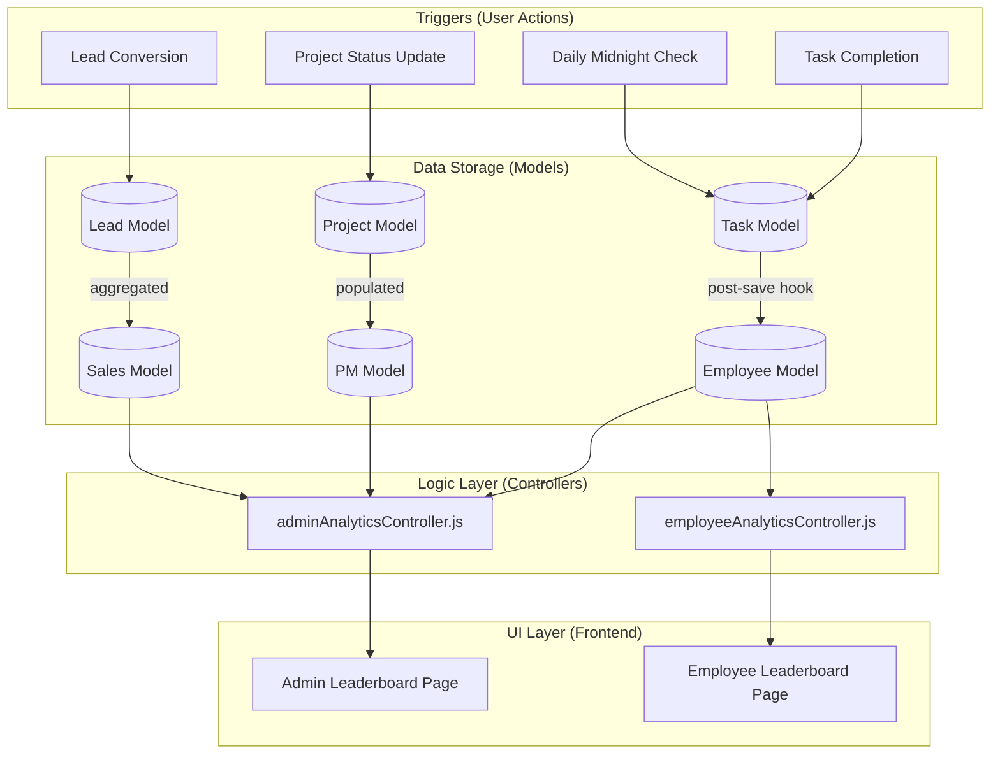

# Leaderboard System Documentation

This document outlines the architecture, working, and data flow of the Leaderboard system in the Appzeto project. It covers how points are calculated, how rankings are determined across different modules (Dev, PM, Sales), and how the data flows from backend to frontend.

---

## 1. System Overview

The leaderboard system is a multi-module feature that tracks and ranks performance across three main roles:
1.  **Developers (Employee Module)**: Ranked by a points-based system driven by task completion.
2.  **Project Managers (PM Module)**: Ranked by a performance score derived from project completion rates and timeliness.
3.  **Sales Executives (Sales Module)**: Ranked by total revenue generated from converted leads.

---

## 2. Data Flow Architecture

The following diagram illustrates how data flows from user actions to the final leaderboard display.



---

## 3. Module-Specific Logic

### A. Developer Leaderboard (Points-Based)

Developers earn or lose points based on their task performance.

| Action | Points | Logic Location |
| :--- | :--- | :--- |
| **On-Time Completion** | **+1** | `Task.js` -> `calculatePoints()` |
| **Overdue Completion** | **0** | `Task.js` -> `calculatePoints()` |
| **Daily Overdue Penalty** | **-1 per day** | `Task.js` -> `deductDailyPoints()` |

#### Ranking Calculation:
1.  Points are stored in the `points` field of the `Employee` model.
2.  A `pointsHistory` array tracks every point change with a timestamp and reason.
3.  **Sorting**: Sorted by `points` (Descending).

---

### B. Project Manager Leaderboard (Outcome-Based)

PMs are ranked based on a composite "Performance Score".

#### Performance Score Formula:
```
Performance Score = Completion Rate + Bonuses - Penalties
```
-   **Completion Rate**: `(Completed Projects / Total Projects) * 100`
-   **Bonus**: `+30` if there are **zero** overdue projects.
-   **Penalty**: `-10` per **overdue** project.
-   **Clamping**: The final score is always between `0` and `100`.

#### Ranking Calculation:
1.  **Primary**: Performance Score (Highest first).
2.  **Secondary**: Project Completion Rate.
3.  **Tertiary**: Lower number of Overdue Projects.

---

### C. Sales Leaderboard (Revenue-Based)

Sales executives are ranked purely based on the business value they bring.

#### Ranking Calculation:
1.  **Primary**: **Total Revenue** (Sum of `value` from all converted leads).
2.  **Secondary**: Total number of conversions (Tie-breaker).

---

## 4. Key Components Breakdown

### Backend Controllers
-   **`adminAnalyticsController.js`**: Contains `getAdminLeaderboard`, which aggregates data for all three modules in a single API call for the Admin.
-   **`employeeAnalyticsController.js`**: Contains `getEmployeeLeaderboard`, tailored for employees to see their personal rank and team performance.

### Backend Models
-   **`Task.js`**: Essential for the Dev leaderboard. Includes `calculatePoints()` and `deductDailyPoints()`.
-   **`Employee.js`**: Stores points and statistics. Includes `updateStatistics()` which is triggered via post-save hooks in `Task.js`.
-   **`Project.js`**: Used to calculate PM performance.
-   **`Lead.js`**: Used to calculate Sales performance.

### Frontend Pages
-   **`Admin_leaderboard.jsx`**: A comprehensive view for admins with tabs for Dev, PM, and Sales.
-   **`Employee_leaderboard.jsx`**: A simplified view for employees to track their progress and rank.

---

## 5. Performance Considerations

1.  **Real-time Aggregation**: Rankings are calculated in real-time when the leaderboard is requested. This ensures data accuracy.
2.  **Hooks**: The system uses Mongoose **post-save hooks** on Tasks to automatically update Employee statistics, reducing the need for expensive calculations during the API call.
3.  **Indexing**: Fields like `points`, `status`, and `assignedTo` are indexed to speed up queries.

---

## 6. Trend Calculation

The system calculates a "Trend" (Up, Down, Stable) over specific periods (Week, Month, Year, etc.) by comparing points at the start of the period vs. the end of the period from the `pointsHistory` array.

```javascript
// Simplified Trend Logic
const change = ((lastPoints - firstPoints) / firstPoints) * 100;
// Result: +15%, -5%, or 0%
```
