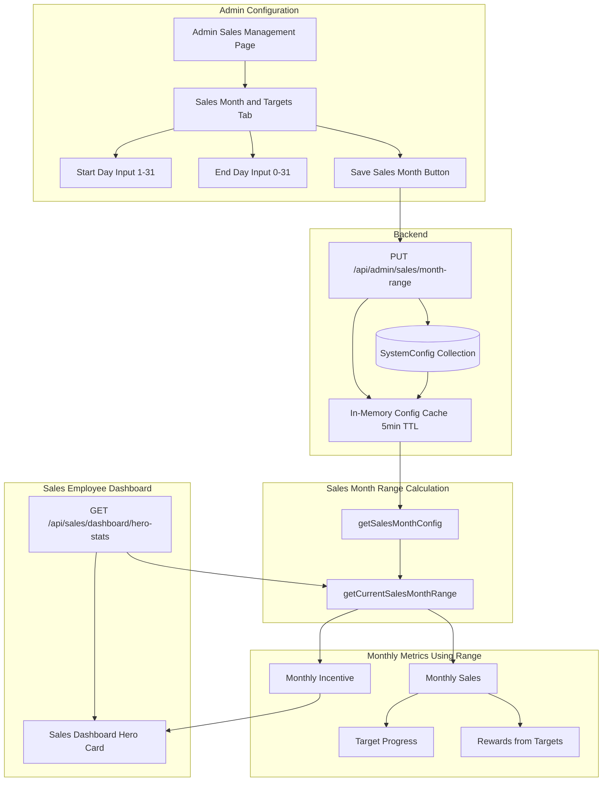
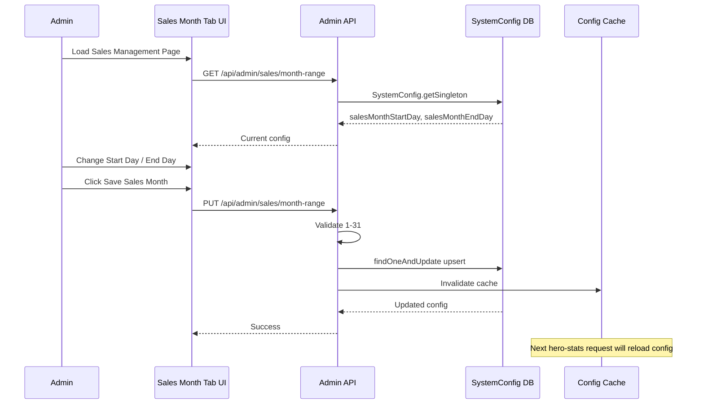
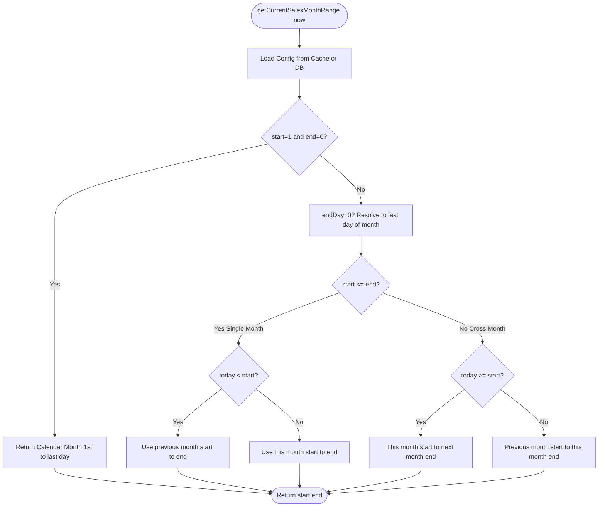
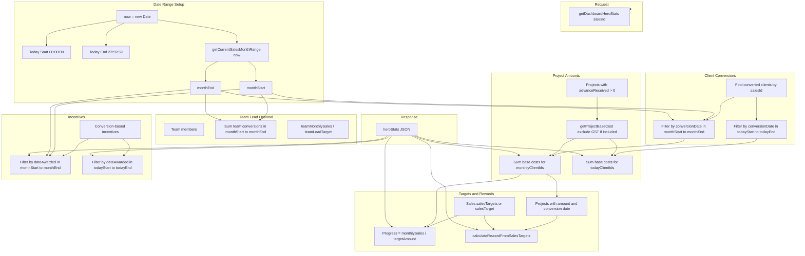

# Sales Month Custom Date Range — Flow & Calculation

This document describes how the configurable sales month date range works in the sales module: the end-to-end flow, where it is used, and how calculations are performed.

---

## 1. Overview

The sales module supports a **custom sales month** (e.g. 10th to 10th) instead of the default calendar month (1st to last day). This affects only:

- **Sales employee dashboard hero card** (monthly sales, target progress, monthly incentive, rewards)
- **Target and incentive calculations** for sales employees

It does **not** affect:

- Admin analytics and reports (remain calendar-month based)
- Today's sales / today's incentive (always use the actual calendar day)
- Other modules (finance, projects, etc.)

---

## 2. High-Level Flow

---

## 3. Admin Configuration Flow

---

## 4. Sales Month Range Calculation Logic

The `getCurrentSalesMonthRange(now)` function computes the active sales month window based on `salesMonthStartDay` and `salesMonthEndDay`.

### 4.1 Config Values

| Config | Meaning | Example |
|--------|---------|---------|
| `salesMonthStartDay` | First day of sales month (1–31) | 10 |
| `salesMonthEndDay` | Last day of sales month; **0** = end of calendar month | 0 or 10 |

### 4.2 Calculation Flow (Mermaid)

### 4.3 Examples (10–10 Configuration)

| Today's Date | Active Sales Month Window |
|--------------|---------------------------|
| Jan 15, 2026 | Jan 10–Feb 10 |
| Feb 5, 2026 | Jan 10–Feb 10 |
| Feb 12, 2026 | Feb 10–Mar 10 |
| Mar 9, 2026 | Feb 10–Mar 10 |
| Mar 10, 2026 | Mar 10–Apr 10 |

### 4.4 Examples (Default 1–0 = Calendar Month)

| Today's Date | Active Sales Month Window |
|--------------|---------------------------|
| Jan 15, 2026 | Jan 1–Jan 31 |
| Feb 28, 2026 | Feb 1–Feb 28 |

### 4.5 Edge Cases

- **Day clamping**: If `endDay` is 31 but the month has 30 days, it is clamped to 30.
- **Leap year**: February 29 is handled correctly when the range includes it.
- **Default config**: `start=1`, `end=0` produces the same result as the original calendar-month logic.

---

## 5. Sales Hero Stats Calculation Flow

---

## 6. Data Flow Summary

| Metric | Date Filter Used | Source |
|--------|------------------|--------|
| **Monthly Sales** | `monthStart` – `monthEnd` (custom range) | `Client.conversionDate` + `Project` base cost |
| **Monthly Incentive** | `monthStart` – `monthEnd` (custom range) | `Incentive.dateAwarded` |
| **Target Progress** | `monthlySales` (within custom range) | `Sales.salesTargets` |
| **Rewards** | `monthlyProjectsData` (within custom range) | `calculateRewardFromSalesTargets` |
| **Today's Sales** | `todayStart` – `todayEnd` (calendar day) | Same as monthly, but today filter |
| **Today's Incentive** | `todayStart` – `todayEnd` (calendar day) | Same as monthly, but today filter |
| **Team Lead Progress** | `monthStart` – `monthEnd` (custom range) | Team members' conversions |

---

## 7. Key Files

| File | Purpose |
|------|---------|
| `backend/models/SystemConfig.js` | Stores `salesMonthStartDay`, `salesMonthEndDay` |
| `backend/utils/salesMonthConfig.js` | Loads/updates config; in-memory cache (5 min TTL) |
| `backend/utils/salesMonthRange.js` | `getCurrentSalesMonthRange(now)` — computes window |
| `backend/controllers/adminSalesController.js` | `getSalesMonthRangeConfig`, `updateSalesMonthRangeConfig` |
| `backend/controllers/salesController.js` | `getDashboardHeroStats` — uses range for monthly metrics |
| `frontend/.../Admin_sales_management.jsx` | Sales Month & Targets tab UI |

---

## 8. Backwards Compatibility

- **Default config** (`start=1`, `end=0`): Produces the same calendar-month range as before.
- **No config in DB**: Uses defaults; behavior is unchanged.
- **Admin analytics**: Unchanged; continue to use calendar months.
- **Other modules**: Unaffected; only the sales hero stats endpoint uses the custom range.
